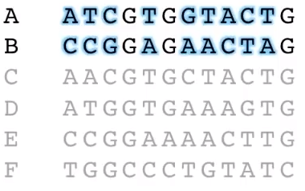

# Phylogenetic trees by hand

1\) Start with aligned sequences:

2\) Build a table of all of the differences between two sequences. For example, sequences A and B have 9 differences

3\) Find a pair of sequences that has the fewest differences. In this case, there's a tie--\(B and E\) and \(A and C\) each only have 2 differences. Draw branches to connect those pairs.

4\) Re-do the table \(from step 2\) but with A-C and B-E as one group. To find the number of differences between a group \(like \(A and C\)\) and a single sequence \(like D\) just take the average. For example, D has 4 differences with A and 5 differences with C, so it has 4.5 differences with \(A and C\). 

Now we just keep repeating steps 3 and 4, like so:

\(3 again\) The two sequences that have the fewest differences are \(A and C\) and D. So let's combine those. 

\(4 again\) make the new table

\(3 again\) The sequences with the fewest differences are \(A and C and D\) and \(B and E\). Combine those

At this point, we don't need to make another table because we only have 1 sequence left \(poor F\). So let's just throw that on the end:



