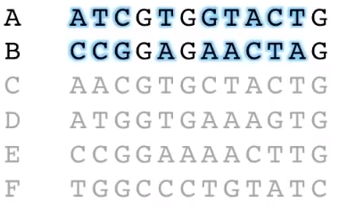

# Pyrosequencing

### Key Points

#### Pyrosequencing:

* was the first of the high-throughput, **next-generation** sequencing technologies.
* uses **luciferase** to release light whenever a dNTP is added to a growing strand.
* uses beads and a picotitre plate to put one strand of DNA in one well.
* has a relatively high read length, around 500bp. 

### Review Questions

\(Answers at the bottom of the page\)

1. Why was pyrosequencing an important milestone in genomics?
2. Summarize the basic mechanism for pyrosequencing.
3. Recall that, in Sanger Sequencing, ddNTPs were radio or florescently labeled. How are bases in Pyrosequencing labeled? 

### **Overview**

By 2001, the U.S. government had spent billions of dollars and many years using Sanger Sequencing to sequence the human genome. If, instead, the human genome project had begun just four years later,  the entire project would have been orders or magnitude cheaper and faster. 

The breakthrough that drastically decreased the cost and time required to sequence DNA sequencing, the advent of 'next-generation' sequencing, was pyrosequencing, first commercialized by 454 Life Sciences around 2005. A single run of Sanger sequencing can produce about 1000 base pairs at once. By contrast, the first generation of pyrosequencing \(the GS 20 instrument\) could produce up to 60,000,000 base pairs at once. 

Pyrosequencing is a sequencing-by-synthesis method that involves a combination of emulsion PCR and pyrosequencing. It requires no gels, dyes, or ddNTPs, but rather relies on light generation after nucleotides are incorporated into a growing strand of DNA.

In short, the pyrosequencing protocol places single fragments of DNA, connected to a bead, into the small wells of a picotiter plate \(think like a 96-well microtiter plate, but with ~1.7 million teeny wells\), along with the polymerase and other factors needed for DNA amplification. In each cycle, only one dNTP is added to the sequencing reaction. If that dNTP is next in the DNA sequence that's in a particular picotiter well, then DNA polymerase will incorporate that dNTP into the growing strand. When that happens, pyrophosphate \(PPi\) is released. The clever bit of pyrosequencing is that the enzymes sulfurylase and luciferase are also in the picotiter well, and they react with the PPi to produce light. 

So effectively, pyrosequencing involves washing each of 4 dNTPs in order over and over again, and having a camera record which wells light up. The wells that light up when dATP is added have "A" next in their sequence, and so on.  

### **More Detail**

### **Additional Considerations**

### Links





### Videos!



### Question Answers

